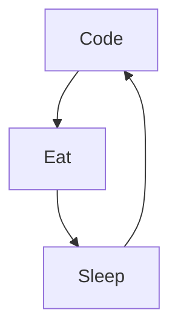

# Joel

I'm Joel from Togo🌴, Back-End developper. I really enjoy learning languages and frameworks like Python, JS and React.

Actually:

🌱 I’m currently learning amazing things ...

📫 How to reach me: Instagram or email

### Languages and tools

  
  
  
  
  
  
  
  
  

<!--
**Kpoti20/Kpoti20** is a ✨ _special_ ✨ repository because its `README.md` (this file) appears on your GitHub profile.

Here are some ideas to get you started:

- 🔭 I’m currently working on ...
- 🌱 I’m currently learning ...
- 👯 I’m looking to collaborate on ...
- 🤔 I’m looking for help with ...
- 💬 Ask me about ...
- 📫 How to reach me: ...
- 😄 Pronouns: ...
- ⚡ Fun fact: ...
-->

### My daily routine :

